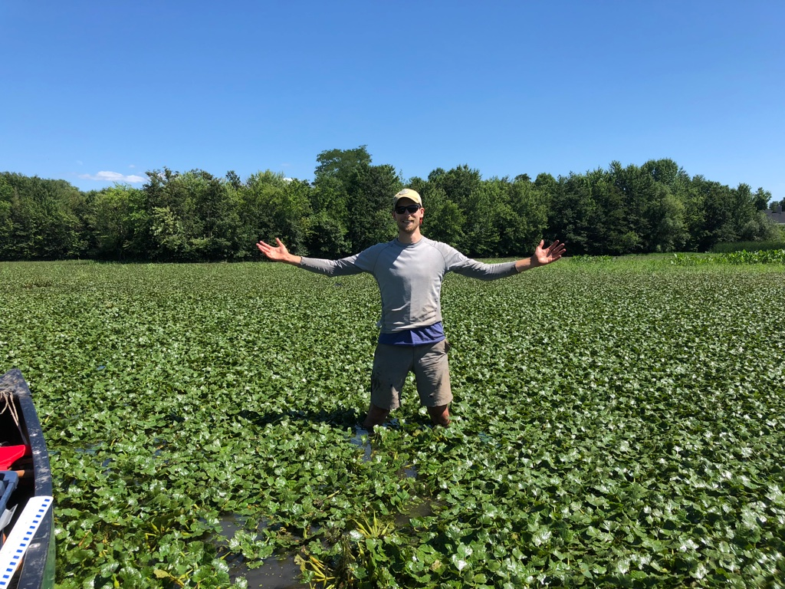

# Biological Control of Water Chestnut

# Insect herbivory of floating aquatic plants

# Societal attitudes towards invasive species management 

Wade Simmons is a PhD student in the Department of Natural Resources and the Environment at Cornell University. Wade is motivated by conservation, and focuses his research on invasives species issues. In particular, his graduate research is on the biological control of water chestnut *Trapa natans* a floating aquatic plant that is problematic in eastern North America. He currently maintains the colony of *Galerucella birmanica*, a leaf-feeding beetle that specializes on water chestnut, and conducts research on the life history and food choices of the species.

Wade is also interested in the societal views of invasive species management, and is involved in reserach projects measuring human attitudes and perceptions of management. 

