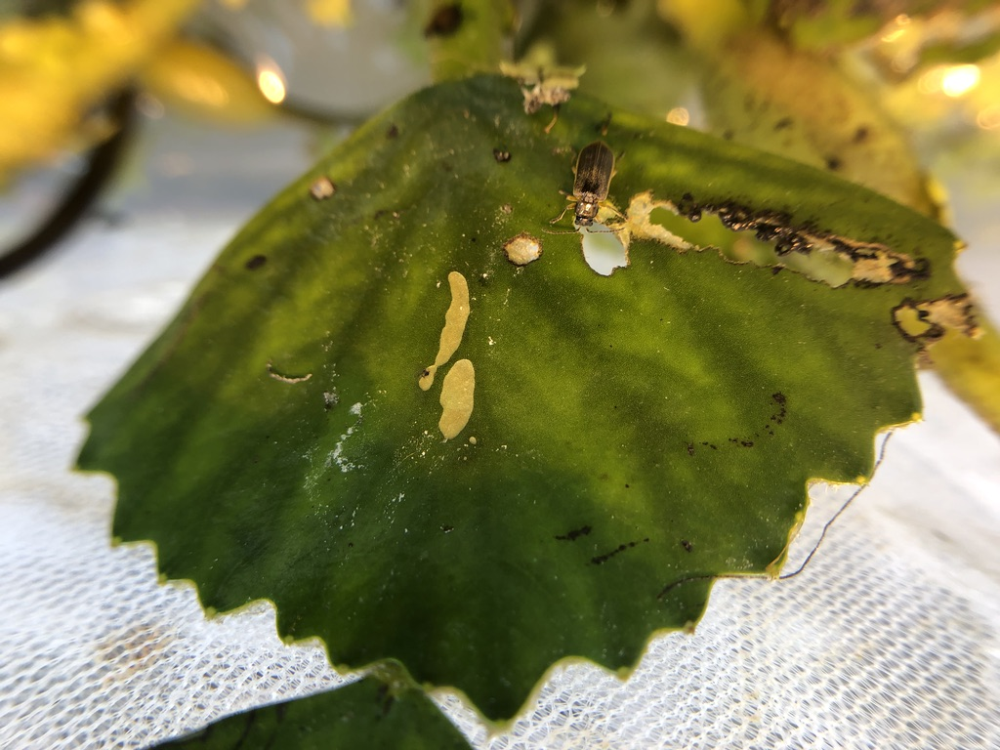
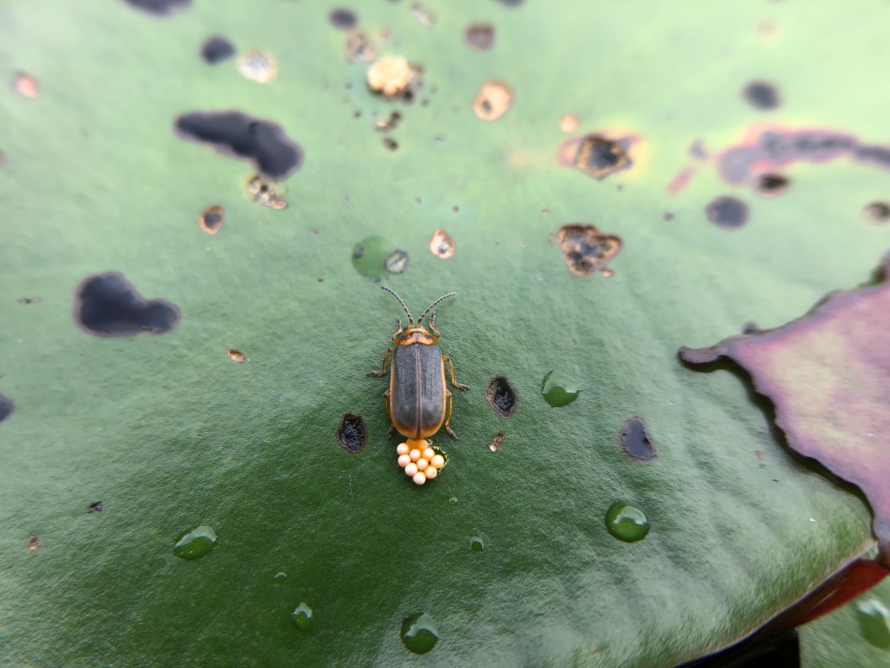

## Welcome to my website! Let's talk about invasive species and conservation! 

### Who am I?

I'm a PhD student in the Department of Natural Resources and the Environment at Cornell University studying the ecology, management, and societal attitudes of biological invasions. In particular, my graduate research focuses on the non-native aquatic plant water chestnut, *Trapa natans*, which can dominate surfaces of freshwaters in eastern North America. In addition to documenting the life history of the plant and its impacts on water chemistry, I am researching biological control of the plant with a specialist leaf-feeding beetle, *Galerucella birmanica*, a project that was prioritized by land managers in New York State. My biological control research involves experiments scrutinizing the ecological implications of releasing the biocontrol insect into North America. I am advised in this work by (Dr. Bernd Blossey)[https://dnr.cals.cornell.edu/people/bernd-blossey/].

Contact Info:
 * wps42@cornell.edu
 * Pronouns: he / him / his

